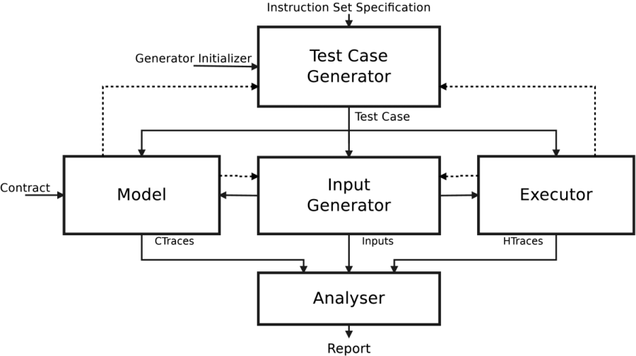

# Revizor's Architecture

Revizor has **five** chief components:

1. Test Case Generator
2. Input Generator
3. Model
4. Executor
5. Analyser

The **Test Case Generator** and **Input Generator** are responsible for
generating random test cases to be run through the **Model** and **Executor**.
The results are examined by the **Analyser** for contract violations.

## Test Case Generator

The TCG is responsible for generating random assembly test cases. It takes an
Instruction Set Specification as input in order for it to understand the
instructions and syntax it can use for generation.

## Input Generator

The IG is responsible for generating the *inputs* that are passed into a test
case created by the TCG. Largely, this means **register** and **memory** values
that the microarchitecture will be primed with before executing the test case.
In this way, a single test case program can be run across several different
inputs, allowing for multiple contract traces (and later, hardware traces) to be
collected for analysis.

## Model

The Model's job is to accept test cases and inputs from the TCG & IG and
*emulate* the test case to collect **contract traces**. A single test case seeded
with several inputs (`N` inputs) will create several contract traces (`N`
contract traces) as the model's output. These are passed to the Analyser to
determine **input classes**.

## Executor

The Executor, on the other side from the Model, is responsible for running the
*same* test cases (with the *same* inputs) on physical hardware to collect
**hardware traces**. Hardware traces from the same input class are collected and
studied by the Analyser to detect **contract violations**.

## Analyser

The Analyser receives contract traces from the Model and hardware traces from
the Executor to accomplish two primary goals:

1. Compare contract traces to set up **input classes**.
2. Compare hardware traces to detect **contract violations**.

[comment]: <> (## Instruction Set Spec)

[comment]: <> (This XML file: https://www.uops.info/xml.html originating from Intel XED &#40;https://intelxed.github.io/&#41;)

[comment]: <> (Received from: `--instruction-set` &#40;or `-s`&#41; CLI argument.)

[comment]: <> (Passed down to: `Generator.__init__`)

[comment]: <> (## Generator Initializer)

[comment]: <> (None so far.)

[comment]: <> (In future, may include test case templates, grammar, etc.)

[comment]: <> (## Test Case)

[comment]: <> (An assembly file. Currently, in Intel syntax.)

[comment]: <> (Received from: `self.generator.create_test_case&#40;&#41;` + `self.generator.materialize&#40;filename&#41;`)

[comment]: <> (Passed down to: `model.load_test_case` and `executor.load_test_case`)

[comment]: <> (## Inputs)

[comment]: <> (Currently, each input is a single 32-bit integer, used later as a PRNG seed inside the test case to initialize memory and registers.)

[comment]: <> (Inputs are generated in batches; that is, Input Generator returns `List[int]`.)

[comment]: <> (Received from: `input_gen.generate&#40;...&#41;`)

[comment]: <> (Passed down to: `model.trace_test_case&#40;inputs&#41;` and `executor.trace_test_case&#40;inputs&#41;`.)
