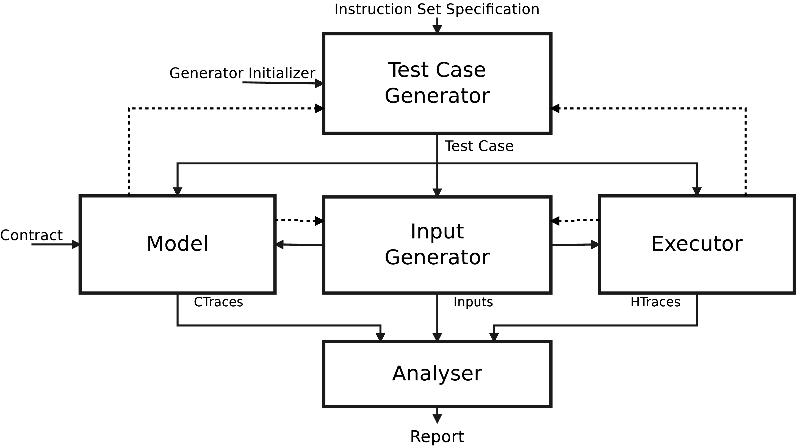

# Architecture

**Under construction**

[comment]: <> (## Instruction Set Spec)

[comment]: <> (This XML file: https://www.uops.info/xml.html originating from Intel XED &#40;https://intelxed.github.io/&#41;)

[comment]: <> (Received from: `--instruction-set` &#40;or `-s`&#41; CLI argument.)

[comment]: <> (Passed down to: `Generator.__init__`)

[comment]: <> (## Generator Initializer)

[comment]: <> (None so far.)

[comment]: <> (In future, may include test case templates, grammar, etc.)

[comment]: <> (## Test Case)

[comment]: <> (An assembly file. Currently, in Intel syntax.)

[comment]: <> (Received from: `self.generator.create_test_case&#40;&#41;` + `self.generator.materialize&#40;filename&#41;`)

[comment]: <> (Passed down to: `model.load_test_case` and `executor.load_test_case`)

[comment]: <> (## Inputs)

[comment]: <> (Currently, each input is a single 32-bit integer, used later as a PRNG seed inside the test case to initialize memory and registers.)

[comment]: <> (Inputs are generated in batches; that is, Input Generator returns `List[int]`.)

[comment]: <> (Received from: `input_gen.generate&#40;...&#41;`)

[comment]: <> (Passed down to: `model.trace_test_case&#40;inputs&#41;` and `executor.trace_test_case&#40;inputs&#41;`.)
