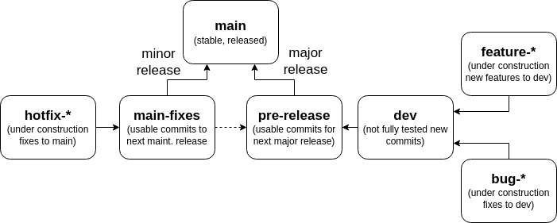

# Development

This page contains various bits of information helpful when developing and expanding Revizor.

## Tests

To run automated tests you will need to install a few more dependencies:

* [Bash Automated Testing System](https://bats-core.readthedocs.io/en/latest/index.html)
* [mypy](https://mypy.readthedocs.io/en/latest/getting_started.html#installing-and-running-mypy)
* [flake8](https://flake8.pycqa.org/en/latest/index.html)

With the dependencies installed, you can run the tests with:

```bash
./tests/runtests.sh
```

Note that some of the acceptance tests are microarchitecture-dependent.
These tests are labeled "Detection" (e.g., "Detection [spectre-type] Spectre V1; load variant"), and they may fail if the CPU under test does not have a given vulnerability.
Generally, if a few of these tests fail, it is not a problem, but if all of them (or a significant portion) fail, it indicates an issue with the fuzzer.

## Code Style

Please follow these coding standards when writing code for inclusion in Revizor.

Python:

* Unless otherwise specified, follow PEP 8. But remember that PEP 8 is only a guide, so respect the style of the surrounding code as a primary goal.
* An exception to PEP 8 is our rules on line lengths. Don’t limit lines of code to 79 characters if it means the code looks significantly uglier or is harder to read. We allow up to 100 characters.
* All files should be formatted using the `flake8` auto-formatter. Use all default settings except for the line width (`--max-line-length 100`)
* The Python and C files use 4 spaces for indentation, and YAML uses 2 spaces.
* The project repository includes an .editorconfig file. We recommend using a text editor with EditorConfig support to avoid indentation and whitespace issues.
* Use underscores, not camelCase, for variable, function and method names (i.e. poll.get_unique_voters(), not poll.getUniqueVoters()).
* Use InitialCaps for class names (or for factory functions that return classes).
* In docstrings, follow PEP 257.

C:

* All files should be formatted using the `clang-format`. The settings are included into the `.clang-format` files in the directories with C files. Just run the formatter with: `clang-format -i *.c`

Misc:

* Remove import statements that are no longer used when you change code. flake8 will identify these imports for you. If an unused import needs to remain for backwards-compatibility, mark the end of with # NOQA to silence the flake8 warning.
* Systematically remove all trailing whitespaces from your code as those add unnecessary bytes, add visual clutter to the patches and can also occasionally cause unnecessary merge conflicts. Some IDE’s can be configured to automatically remove them and most VCS tools can be set to highlight them in diff outputs.

## Git Messages

We practice the following conventions for commit messages:

```
<scope>: [<type>] <subject>
```

Where:

* `<scope>`: The scope of the change.
* `<type>`: The type of the change.
* `<subject>`: A short description of the change.


### Scopes

The following scopes are typical:


| Scope       | Description                                                      |
| ----------- | ---------------------------------------------------------------- |
| `all`       | Changes that affect the entire project (e.g., major refactoring) |
| `root`      | Root directory changes (e.g., readme, git, author list)          |
| `fuzz`      | Changes to the core fuzzer algorithm.                            |
| `cli`       | Changes to the command-line interface.                           |
| `exec`      | Changes to the executor.                                         |
| `model`     | Changes to the model.                                            |
| `analyser`  | Changes to the analyser.                                         |
| `mini`      | Changes to the postprocessor (i.e., minimizer).                  |
| `code_gen`  | Changes to the program generator                                 |
| `data_gen`  | Changes to the input generator                                   |
| `tests`     | Changes to the tests                                             |
| `isa`       | Changes to the ISA loader or to `get_spec` files                 |

If a commit covers several scopes, use the most relevant one.

If a commit targets a specific architecture (e.g., x86), add the architecture to the scope (e.g., `fuzz/x86`).

### Types

Use one of the following types:

| Type     | Description                                                                   |
| -------- | ----------------------------------------------------------------------------- |
| `feat`   | A new feature.                                                                |
| `fix`    | A bug fix.                                                                    |
| `docs`   | Documentation changes.                                                        |
| `chore`  | Changes to the build process or auxiliary tools.                              |
| `ft`     | Fault tolerance changes (e.g., adding error handling or recovery mechanisms). |
| `refact` | Refactoring of the codebase. This includes code style change.                 |
| `perf`   | Performance improvements.                                                     |
| `revert` | Reverts a previous commit.                                                    |

If possible, try to use only these types.
If you need to use a different type, please discuss it with a maintainer.

## Git Branches

We practice the [git workflow](https://git-scm.com/docs/gitworkflows), with a few modifications.



We use the following branches for graduation:

* `main`: The latest release. This branch should always be stable, and it is the last branch to receive changes.
* `main-fixes`: Commits that go in the next maintenance release. This branch is created from the last release branch.
* `pre-release`: Stable commits that go in the next release.
* `dev`: The development branch. This branch is the first to receive changes.

Commits should be merged upwards:

* `dev` -> `pre-release` -> `main`
* In case of hot fixes, `main-fixes` -> `main` AND `main-fixes` -> `pre-release`

For working on unstable code (e.g., progress on features or bug fixes), use either forks or feature branches.
Use forks if you are the only one working on the feature, and use a pull request to merge the changes back into the main repository.
Use a feature branch if multiple people are working on the feature, in which case name the branch `feature-<name>` or `bugfix-<name>`, and make sure to branch from the `dev` branch.

The only exception is the `gh-pages` branch, which is used for the project's website.
This branch is used by automated tools and should never be used for development.
