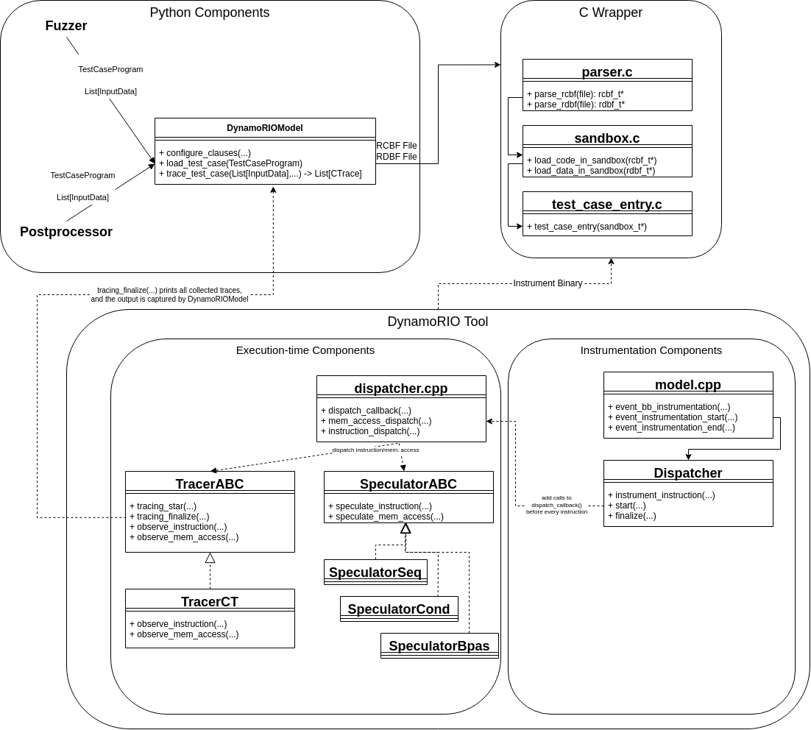

# DynamoRIO-based Model Backend

This document describes the DynamoRIO-based model.
As any other model, this backend is responsible for collecting contract traces for generated test cases.

## Design Overview

This backend is composed of several parts:

* The Python adapter (`rvzr/model_dynamorio/model.py`) is responsible for receiving a test case from Revizor, transforming it into a format that can be executed by the backend, triggering the backend to execute the test case, and returning the collected contract traces to Revizor.
* The Test Case Loader (`rvzr/model_dynamorio/adapter.c`) is a C program that loads a test case program and a batch of inputs into its memory, and executes the test case program with each input in a sequence.
* The DynamoRIO components (`rvzr/model_dynamorio/backend`) are executed together with the test case loader, and they instrument the loader binary to collect contract traces.

These components can be roughly divided into the instrumentation-time components that are responsible for modifying the binary, and execution-time components that implement the model logic (i.e., the contract).

[](../assets/dr-model.png)

## Python Adapter

Revizor communicates with the backend through a Python adapter (`rvzr/model_dynamorio/model.py:DynamoRIOModel`).

At the beginning of the fuzzing process, Revizor configures the backend by calling `configure_clauses` method.
This configuration will be later passed down to the backend when the test case is executed.

During the fuzzing process, Revizor sends test cases to the backend by calling `load_test_case` method, and then triggers the backend to execute the test case by calling `trace_test_case` method.
Internally, `trace_test_case` will call the backend to execute the test case and collect the contract traces.
The adapter will then parse the traces and return them back to the caller.

The `trace_test_case` method implements the following algorithm:

- Convert test case program and inputs into RCBF and RDBF files, respectively
- For each input, call the test case loader with the RCBF and RDBF files. Attach the DynamoRIO backend to the call so that the binary instrumentation is performed:
```shell
~/.local/dynamorio/drrun -c ~/.local/dynamorio/libdr_model.so --tracer <observation-clause> -- ~/.local/dynamorio/adapter <rcbf> <rdbf>
```
- Receive contract traces from the backend and convert them into `CTrace` objects
- Return the list of collected `CTrace` objects to the caller (usually, `fuzzer.py`)

## Test Case Loader

Since the test cases produced by Revizor are raw binaries, they cannot be directly executed (e.g., they don't have `libc` linked).
The test case loader (`rvzr/model_dynamorio/adapter.c`) is a simple C program that fixes this issue by providing a wrapper around the test case binary.

The loader implements the following algorithm:

- Receive the test case binary and an input from the Python adapter via CLI arguments
- Load the test case binary and the input into dedicated memory regions
- Print the addresses of the test case and input memory regions (for trace normalization)
- Initialize registers based on the input
- Jump to the test case binary entry point
- Return

### DynamoRIO Tool

The DynamoRIO tool (`rvzr/model_dynamorio/backend`) is responsible for instrumenting the test case loader binary and collecting contract traces.

### Instrumentation Components

The instrumentation components modify the binary of the test case loader by adding a call to the function `dispatch_callback` before every instruction in the binary (or more specifically, every instruction in the `test_case_entry` function of the loader).

The tool interacts with DynamoRIO through the `model.cpp` module.
This module registers an event for entering the `test_case_entry`, which triggers the start of instrumentation.
The module also registers an event for every instruction in the `test_case_entry`, and the event in turn calls the `Dispatch::instrument_instruction()`.

The `Dispatch` class implements the actual instrumentation logic.
When the `instrument_instruction()` method is called, it inserts a clean call to the `dispatch_callback` function before the instruction.
The call receives the PC and opcode of the instruction as arguments.
DynamoRIO also automatically saves the complete register state before the call, thus making it available to `dispatch_callback`.

### Execution-Time Components

The execution-time components are responsible for implementing the contract logic, and are triggered by the `dispatch_callback` function.
At the current state of the backend, the dispatch callback invokes only two classes, Tracer and Speculator, that implement the observation and execution clauses, respectively.

Subclasses of `TracerABC` record contract-relevant information via `observe_instruction` and `observe_mem_access` methods.
E.g., `TracerCT` implements `CT` observation clause by recording the PC of instructions upon `observe_instruction` and the address of memory accesses upon `observe_mem_access`.

Subclasses of `SpeculatorABC` implement the contract speculation logic.
E.g., `SpeculatorCond` implements `speculate_instruction`.
When this method is called with a branch instruction, the class takes a checkpoint of the process state, flips the branch condition (i.e., modified `FLAGS` register), and continues the execution.
During the simulated speculation, each call to `speculate_instruction` counts the number of executed instructions, and when the number reaches the limit (e.g., 256), the class restores the checkpoint and continues the execution from the original state. (Actually, the algorithm is more complex, but this is the general idea.)

When the instrumentation ends (according to `model.cpp`), the tracer's `tracing_finalized` method is called, and the tracer prints the collected traces to `stdout` in a compressed binary format.
The Python adapter picks up this output, decodes, and returns it to Revizor.
