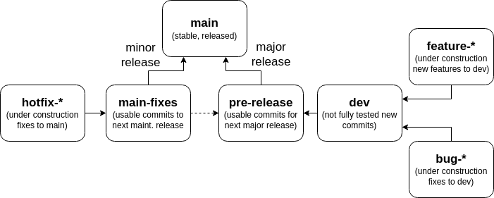

# Git Workflow Guidelines

## Git Messages

We practice the following conventions for commit messages:

```
<scope>: [<type>] <subject>
```

Where:

* `<scope>`: The scope of the change.
* `<type>`: The type of the change.
* `<subject>`: A short description of the change.


### Scopes

The following scopes are typical:


| Scope       | Description                                                      |
| ----------- | ---------------------------------------------------------------- |
| `all`       | Changes that affect the entire project (e.g., major refactoring) |
| `root`      | Root directory changes (e.g., readme, git, author list)          |
| `fuzz`      | Changes to the core fuzzer algorithm.                            |
| `cli`       | Changes to the command-line interface.                           |
| `exec`      | Changes to the executor.                                         |
| `model`     | Changes to the model.                                            |
| `analyser`  | Changes to the analyser.                                         |
| `mini`      | Changes to the postprocessor (i.e., minimizer).                  |
| `code_gen`  | Changes to the program generator                                 |
| `data_gen`  | Changes to the input generator                                   |
| `tests`     | Changes to the tests                                             |
| `isa`       | Changes to the ISA loader or to `get_spec` files                 |

If a commit covers several scopes, use the most relevant one.

If a commit targets a specific architecture (e.g., x86), add the architecture to the scope (e.g., `fuzz/x86`).

### Types

Use one of the following types:

| Type     | Description                                                                   |
| -------- | ----------------------------------------------------------------------------- |
| `feat`   | A new feature.                                                                |
| `fix`    | A bug fix.                                                                    |
| `docs`   | Documentation changes.                                                        |
| `chore`  | Changes to the build process or auxiliary tools.                              |
| `ft`     | Fault tolerance changes (e.g., adding error handling or recovery mechanisms). |
| `refact` | Refactoring of the codebase. This includes code style change.                 |
| `perf`   | Performance improvements.                                                     |
| `revert` | Reverts a previous commit.                                                    |

If possible, try to use only these types.
If you need to use a different type, please discuss it with a maintainer.

## Git Branches

We practice the [git workflow](https://git-scm.com/docs/gitworkflows), with a few modifications.



We use the following branches for graduation:

* `main`: The latest release. This branch should always be stable, and it is the last branch to receive changes.
* `main-fixes`: Commits that go in the next maintenance release. This branch is created from the last release branch.
* `dev`: The development branch. This branch is the first to receive changes.

Commits should be merged upwards:

* `dev` -> `pre-release` -> `main`
* In case of hot fixes, `main-fixes` -> `main` AND `main-fixes` -> `pre-release`

For working on unstable code (e.g., progress on features or bug fixes), use either forks or feature branches.
Use forks if you are the only one working on the feature, and use a pull request to merge the changes back into the main repository.
Use a feature branch if multiple people are working on the feature, in which case name the branch `feature-<name>` or `bugfix-<name>`, and make sure to branch from the `dev` branch.

The only exception is the `gh-pages` branch, which is used for the project's website.
This branch is used by automated tools and should never be used for development.
