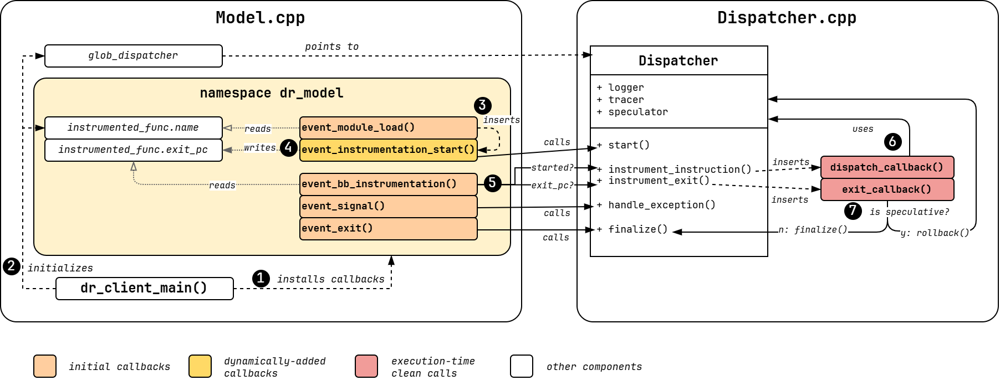

# DynamoRIO-based Model Backend

This document describes the DynamoRIO-based model.
As any other model, this backend is responsible for collecting contract traces for generated test cases.

## Design Overview

This backend is composed of several parts:

* The Python adapter (`rvzr/model_dynamorio/model.py`) is responsible for receiving a test case from Revizor, transforming it into a format that can be executed by the backend, triggering the backend to execute the test case, and returning the collected contract traces to Revizor.
* The Test Case Loader (`rvzr/model_dynamorio/adapter.c`) is a C program that loads a test case program and a batch of inputs into its memory, and executes the test case program with each input in a sequence.
* The DynamoRIO components (`rvzr/model_dynamorio/backend`) are executed together with the test case loader, and they instrument the loader binary to collect contract traces.

These components can be roughly divided into the instrumentation-time components that are responsible for modifying the binary, and execution-time components that implement the model logic (i.e., the contract).

[](../assets/dr-model.png)

## Python Adapter

Revizor communicates with the backend through a Python adapter (`rvzr/model_dynamorio/model.py:DynamoRIOModel`).

At the beginning of the fuzzing process, Revizor configures the backend by calling `configure_clauses` method.
This configuration will be later passed down to the backend when the test case is executed.

During the fuzzing process, Revizor sends test cases to the backend by calling `load_test_case` method, and then triggers the backend to execute the test case by calling `trace_test_case` method.
Internally, `trace_test_case` will call the backend to execute the test case and collect the contract traces.
The adapter will then parse the traces and return them back to the caller.

The `trace_test_case` method implements the following algorithm:

- Convert test case program and inputs into RCBF and RDBF files, respectively
- For each input, call the test case loader with the RCBF and RDBF files. Attach the DynamoRIO backend to the call so that the binary instrumentation is performed:
```shell
~/.local/dynamorio/drrun -c ~/.local/dynamorio/libdr_model.so --tracer <observation-clause> -- ~/.local/dynamorio/adapter <rcbf> <rdbf>
```
- Parse contract traces from the backend and convert them into `CTrace` objects
- Return the list of collected `CTrace` objects to the caller (usually, `fuzzer.py`)

## Test Case Loader

Since the test cases produced by Revizor are raw binaries, they cannot be directly executed (e.g., they don't have `libc` linked).
The test case loader (`rvzr/model_dynamorio/adapter.c`) is a simple C program that fixes this issue by providing a wrapper around the test case binary.

The loader implements the following algorithm:

- Receive the test case binary and an input from the Python adapter via CLI arguments
- Load the test case binary and the input into dedicated memory regions
- Print the addresses of the test case and input memory regions (for trace normalization)
- Initialize registers based on the input
- Jump to the test case binary entry point
- Return

## DynamoRIO Tool

The DynamoRIO tool (`rvzr/model_dynamorio/backend`) is responsible for instrumenting the test case loader binary and collecting contract traces.

### Implementation Overview

All instrumentation logic is implemented as a DynamoRIO client. In particular,
`model.cpp` contains the event callbacks that are executed at instrumentation time,
while `dispatcher.cpp` contains the body of the callbacks that are inserted
by the DR client and are executed before every instruction at runtime. Finally, the `Dispatcher` object holds the state that is
shared between instrumentation-time callbacks and execution-time callbacks.

The following figure provides an overview of the implementation.

[](../assets/dr-instrumentation.png)

1. `dr_client_main()` is responsible of installing the initial instrumentation callbacks to hook all relevant DR events (`module_load`, `bb_translation`, exceptions and the `exit` event)
2. `dr_client_main()` also sets the name of the function to instrument (passed by `cli.cpp`)
3. on `module_load`, the instrumentation checks for the presence of the target function in the loaded module. If found, the callback adds a `drwarp` callback (`event_instrumentation_start`) which will be executed at the start of the target function
4. once a call to the target function is found, the `event_instrumentation_start` will save the return address in a global object (`instrumented_func`) and call `start()` on the dispatcher
5. from that moment on, every translated basic block is instrumented by our client, in particular:
    - a `dispatch_callback()` is inserted before every instruction
    - at the function exit point (i.e. the previously saved return addres) an `exit_callback` is inserted
6. these callbacks are executed at runtime with the following effects:
    - the `dispatch_callback()` implements the observation and execution clauses (see next section)
    - the `exit_callback()` checks the current speculation state before exiting:
        - speculative exits cause a rollback
        - architectural exit causes the instrumentation to stop

Finally, exceptions and the `exit` event are also forwarded to the Dispatcher:

- Speculative **exceptions** will cause a rollback, while architectural ones are forwarded to the target program
- The **exit** event stops instrumentation and flushes all logs (in case the exit callback has not been executed architecturally)

### Instrumentation Components

The instrumentation components modify the binary of the test case loader by adding a call to the function `dispatch_callback` before every instruction in the binary (or more specifically, every instruction in the `test_case_entry` function of the loader).

The tool interacts with DynamoRIO through the `model.cpp` module.
This module registers an event for entering the `test_case_entry`, which triggers the flush of the internal DynamoRIO code fragment cache and the start of instrumentation.
The module also registers an event for every instruction in the `test_case_entry`, and the event in turn calls the `Dispatch::instrument_instruction()`. Finally, exceptions are hooked and passed to the dispatcher through `Dispatch::handle_exception()`, which can decide to either handle the signal (e.g. on speculative paths) or forward it to the test case (e.g. architectural exceptions).

The `Dispatch` class implements the actual instrumentation logic.
When the `instrument_instruction()` method is called, it inserts a clean call to the `dispatch_callback` function before the instruction.
The call receives the PC and opcode of the instruction as arguments.
DynamoRIO also automatically saves the complete register state before the call, thus making it available to `dispatch_callback`.

### Execution-Time Components

The execution-time components are responsible for implementing the contract logic, and are triggered by the `dispatch_callback` function.
At the current state of the backend, the dispatch callback invokes only two classes, Tracer and Speculator, that implement the observation and execution clauses, respectively. Optionally, each component can log additional events, e.g.
speculation rollbacks or the current register state, through a shared `Logger` component.

Subclasses of `TracerABC` record contract-relevant information via `observe_instruction` and `observe_mem_access` methods.
E.g., `TracerCT` implements `CT` observation clause by recording the PC of instructions upon `observe_instruction` and the address of memory accesses upon `observe_mem_access`. Currently, `observe_exception` simply adds a special entry to the trace to indicate that the program ended due to an (architectural) exception.

Subclasses of `SpeculatorABC` implement the contract speculation logic.
E.g., `SpeculatorCond` implements `speculate_instruction`.
When this method is called with a branch instruction, the class takes a checkpoint of the process state, flips the branch condition (i.e., modified `FLAGS` register), and continues the execution.
During the simulated speculation, each call to `speculate_instruction` counts the number of executed instructions, and when the number reaches the limit (e.g., 256), the class restores the checkpoint and continues the execution from the original state. (Actually, the algorithm is more complex, but this is the general idea.)

When the instrumentation ends (according to `model.cpp`), the tracer's `tracing_finalized` method is called, during which any remaining traces are flushed into the trace file, together with an "End Of Trace" entry.
The Python adapter will then read the trace file, decode it, and return the corresponding CTrace to Revizor.

### Standalone Usage

The DR tool can be used as a standalone tool to collect the runtime trace of any program, independently from the rest of Revizor's infrastructure.

A typical usage is for example:

```shell
~/.local/dynamorio/drrun -c ~/.local/dynamorio/libdr_model.so --tracer <observation-clause> --speculator <speculation-clause> -- ls /dev/null
```

By default, this will instrument `ls` starting from `__libc_start_main` until the end of the program, run it with `/dev/null` as an argument, and generate a binary file called `rvzr_trace.dat` that contains the collected trace. Other flags can be printed using `~/.local/dynamorio/drrun -c ~/.local/dynamorio/libdr_model.so -h`

The trace file location can be changed by adding `--trace-output <PATH>`. Additionally, the tool can also dump the trace in human-readable format to STDOUT using the `--print-trace` flag.

To decode and analyze the trace file, downstream tools should always use the `TraceDecoder` class provided by `trace_decoder.py`. For internal usage, this module also provides a simple entrypoint for trace printing:

```bash
python3 trace_decoder.py rzvr_trace.dat
```

#### Debugging

Attaching a debugger like GDB to the DR tool might not always be the best debugging option, as the program has three separate states:

1. the state of the program being instrumented (e.g. `ls`)
2. the state of the DR client (`libdr_model.so`) instrumentation
3. the state of DynamoRIO itself (`drrun`)

More information about debugging DR clients can be found [here](https://dynamorio.org/page_debugging.html).

For our instrumentation, other (possibly simpler) options are available:

1. **Inspecting Debug Traces**: the DR tool can optionally log extra information, e.g. the complete state of the register file before each instruction, each value being read and written to memory, and speculation events like checkpoints are rollbacks, in a separate debug trace:
    - This option can be enabled using `--log-level <N>`
    - By default, the tool will dump debug entries to `rzvr_dbg_trace.dat` in binary format; to change the path of the debug trace file use `--debug-output <PATH>`
    - `--print-debug-trace` can be used to pretty-print debug entries to STDOUT during execution
    - `trace_decoder.py` also provides a decoder for debug entries
    - **WARNING:** debug traces can become very big, especially for nested speculation
2. **Running DynamoRIO with logging**: DynamoRIO can also produce logs (see DR documentation):

```
~/.local/dynamorio/drrun -debug -loglevel 3 -c ~/.local/dynamorio/libdr_model.so --tracer <observation-clause> --speculator <speculation-clause> -- ls /dev/null
```

