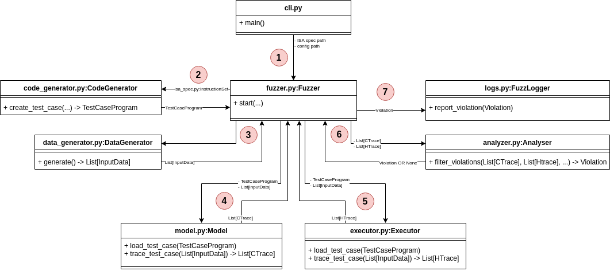

# Architecture Overview & Code Structure

This document introduces Revizor's architecture and key components. It is designed to provide an overview of how the codebase is organized and how the main pieces work together.

!!! info "Prerequisites"
    This document assumes familiarity with the concepts of side-channel attacks, speculative execution, and [Speculation Contracts and Model-based Relational Testing (MRT)](../../topics/contracts.md).

## How Revizor Works

Revizor detects CPU security vulnerabilities using Model-based Relational Testing (MRT). The core idea is to compare what a CPU should leak (according to a leakage model) with what it actually leaks during execution.

Basic process:

1. Generate random assembly programs
2. Execute them on both a leakage model and real hardware
3. Compare the observed hardware behavior with the model's predictions
4. If they match, the CPU behaves as expected (discard the test)
5. If they differ, a potential vulnerability has been found

The leakage model acts as a reference model of the expected CPU behavior. If the real CPU leaks more information than the model predicts (i.e., if it diverges from the reference), this indicates a potential security vulnerability. For details on how leakage models work, see [Speculation Contracts](../../topics/contracts.md).

Revizor runs the following loop until it finds a violation or completes the configured number of test cases:

## 1. Initialization

This step runs once at startup. Revizor reads the fuzzing configuration, which specifies:

- Target CPU architecture
- ISA (instruction set) specification
- Which instructions to test
- Which side channels to monitor
- Other fuzzing parameters

The `cli.py` module handles command-line arguments and creates the main objects: `InstructionSet` (from `isa_spec.py`), `Config` (from `config.py`), and `Fuzzer` (from `fuzzer.py`).

## 2. Code Generation

Each fuzzing round starts by generating a random test program. This is an assembly program with semi-random control flow, built from a pool of allowed instructions.

The code generator can be configured to control the shape of the control flow graph, which instructions to include, and how often each instruction appears. It also (optionally) instruments the program to prevent faults like division by zero.

The `Fuzzer` calls `CodeGenerator.create_test_case()` (in `code_generator.py`), which returns a `TestCaseProgram` object representing the generated assembly program.

## 3. Data Generation

Next, Revizor generates random inputs for the test program. Each input contains initial values for registers and memory. These values are pseudo-random but use fixed seeds for reproducibility.

The `DataGenerator` class (in `data_generator.py`) creates these inputs and returns them as `InputData` objects. See [binary formats](../../ref/binary-formats.md#revizor-data-binary-format-rdbf) for the structure of input data.

## 3.5 Test Case Filtering (Optional)

Some test cases are unlikely to reveal vulnerabilities, so Revizor can filter them out early to save time. This is optional and disabled by default.

Two filters are available:

- Speculation filter: Uses performance counters to check if the test case triggers branch mispredictions. Without mispredictions, the test cannot expose speculative leaks.
- Observation filter: Compares the original test case with a "fenced" version (with serialization instructions added). If both produce identical traces, speculation left no observable effects.

These filters are implemented in architecture-specific fuzzer classes (like `X86Fuzzer` in `rvzr/arch/x86/fuzzer.py`).

## 4. Model Execution

The model executes the test program with each generated input and produces contract traces (CTraces). These traces represent what the model predicts should leak during execution.

The `Model` class (in `model.py`) provides two key methods:

- `load_test_case()`: Loads the program into the model
- `trace_test_case()`: Executes the program with each input and returns CTraces

Revizor supports multiple model backends: [Unicorn](../model-backends/model-unicorn.md) (CPU emulator) and [DynamoRIO](../model-backends/model-dr.md) (dynamic instrumentation). Both implement the same interface.

## 5. Hardware Execution

The executor runs the test program on the target hardware with each input and collects hardware traces (HTraces). A hardware trace is a set of observable microarchitectural effects (like cache state or timing) caused by the test case execution. Traces are typically collected using side-channel techniques (e.g., Prime+Probe, Flush+Reload) or by reading performance counters.

To ensure that the measurements reflect the test case execution (rather than noise), the executor creates a controlled measurement environment by disabling interrupts, flushing caches, and repeating executions multiple times.

The `Executor` class (in `executor.py`) works through a kernel module (`executor_km/`) that performs measurements in kernel space. It provides the same interface as the model: `load_test_case()` and `trace_test_case()`.

## 6. Trace Analysis

The analyzer compares contract traces (what should leak) with hardware traces (what actually leaked) to detect violations. Instead of directly comparing traces, it uses an equivalence class approach.

How it works:

1. Group by contract: Inputs with identical CTraces form a ContractEqClass. According to the model, these inputs should be indistinguishable.
2. Group by hardware: Within each ContractEqClass, inputs with similar HTraces form HardwareEqClasses. These inputs are actually indistinguishable on real hardware.
3. Detect violations: If a ContractEqClass splits into multiple HardwareEqClasses, a violation has occurred. The model says the inputs should look the same, but hardware reveals differences between them.

This approach focuses on information leakage rather than exact trace values, and it essentially implements a non-interference check (see [Theoretical Foundations](../../topics/contracts.md)).

The `Analyser` class (in `analyser.py`) implements this logic in its `filter_violations()` method.

## 7. Post-violation Analysis

When Revizor detects a potential violation, it runs additional tests to filter out false positives. These tests modify execution parameters and verify the violation still occurs. See [post-violation tests](mini.md) for details.

If the violation survives all filters, Revizor reports it to the user and saves reproduction artifacts. The user can then use [minimization tools](../../howto/minimize.md) to simplify the test case and identify the root cause.

The post-violation logic is implemented in `Fuzzer.fuzzing_round()`, and the `FuzzLogger` class handles reporting.
