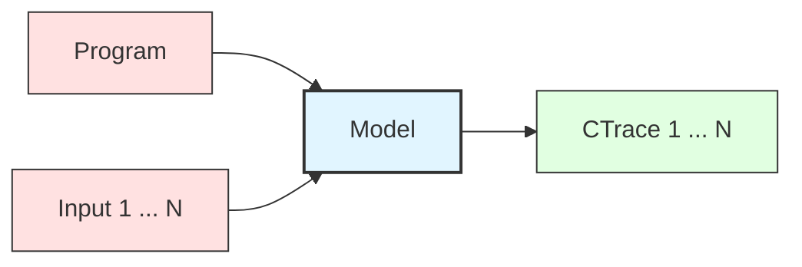
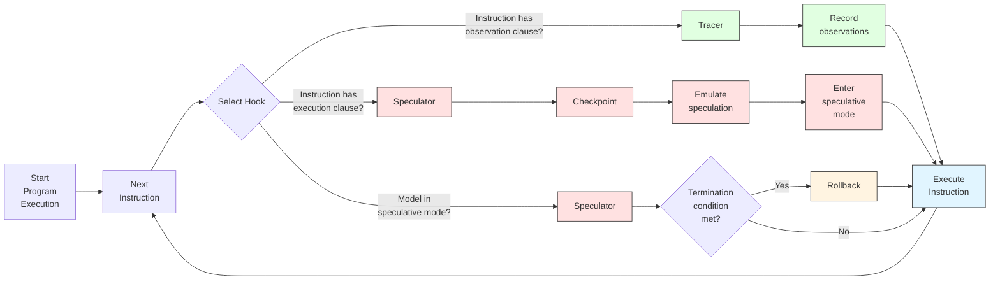

# Leakage Models

A leakage model is an executable implementation of a speculation contract. The model takes a
program and inputs, executes them according to contract rules, and produces contract traces that
represent the information expected to leak. Models enable automated testing by providing a
reference against which real hardware behavior can be compared.

Models solve a practical problem in security testing. Contracts specify what should leak in
abstract terms, but to test hardware, we need concrete predictions for specific programs. The
model bridges this gap by simulating program execution under contract assumptions and recording
observable effects as they occur.

## Implementing Contracts

A model implements contracts through two specialized components: the Tracer and the Speculator.
These components monitor instruction execution through hook functions and modify behavior according
to contract rules.

The Tracer implements the observation clause. It monitors execution of each instruction and records
contract-relevant information. When an instruction with a non-trivial observation clause executes,
the model invokes the corresponding Tracer hook. For example, when a load instruction executes
under a contract that exposes memory addresses, the Tracer hook records the target address. The
Tracer accumulates these observations into a contract trace that represents all information exposed
during execution.

The Speculator implements the execution clause. It modifies the behavior of instructions with
non-trivial execution clauses to simulate microarchitectural optimizations. When such an
instruction executes, the model invokes the Speculator hook, which takes a checkpoint of the
program state and modifies the instruction's behavior. This puts the model into speculative mode.
For example, when a conditional branch executes under a contract that permits misprediction, the
Speculator checkpoints the state, flips the branch condition, and continues on the wrong path.

While in speculative mode, the model checks for termination conditions after each instruction. When
a condition is met, such as the speculation window expiring or encountering a serializing
instruction, the model exits speculative mode and rolls back to the most recent checkpoint. This
restores architectural state and resumes correct execution. Speculation can be nested, with one
speculative region triggering another before the first completes. The Speculator manages a stack of
checkpoints to handle nested speculation correctly.

The hook-based architecture allows models to implement contracts without modifying the core
execution engine. Whenever the model executes an instruction, it checks whether the instruction has
non-trivial observation or execution clauses. If observation clauses are present, Tracer hooks are
invoked. If execution clauses are present, Speculator hooks are invoked. The model also calls hooks
to check speculation termination conditions when in speculative mode. This separation of concerns
makes it straightforward to implement different contracts by providing different Tracer and
Speculator implementations.

## Model Backends

Revizor supports two model backends that implement contracts using different techniques. Both
provide the same interface and produce equivalent contract traces, but they differ in
implementation approach and performance characteristics.

The Unicorn backend uses CPU emulation to execute programs. Unicorn is a CPU emulator derived from
QEMU that supports multiple architectures. The model extends Unicorn with hooks that intercept
instruction execution and memory accesses. When an instruction executes, the hook checks whether
the contract requires recording an observation or triggering speculation. For speculation, the
model uses Unicorn's snapshot and restore capabilities to implement checkpoint-rollback.

The DynamoRIO backend uses dynamic binary instrumentation to execute programs. DynamoRIO inserts
instrumentation code directly into the program at runtime. Before each instruction, the model
injects a callback that checks contract rules. For speculation, the model manipulates register
state to simulate wrong-path execution and uses checkpoints to restore architectural state when
speculation ends. Because the program runs natively on the host CPU, execution is faster than
emulation.

The choice between backends involves trade-offs. The DynamoRIO backend is generally preferable as
it offers better performance and it inherently supports all instructions that can be executed on
the host CPU. However, this backend is more recent and may not support all contract features and
platforms as robustly as the Unicorn backend. Therefore, the Unicorn backend remains available for
use cases where the DynamoRIO backend is not yet suitable.

## Trace Representation

Contract traces are sequences of typed observations. Each observation records one piece of
information that leaked during execution. The trace preserves the order in which observations
occurred, capturing temporal aspects of information flow (although this could be overridden by
the Tracer if the contract prescribes so).

An observation has a type and a value. Types include memory addresses, branch targets, load/store
values, register contents, or any other observable information. The contract determines which types
appear in traces. CT-SEQ traces contain only memory addresses and branch targets. A contract
modeling MDS might include data values. The type system allows precise specification of what
information the contract permits.

## Accuracy and Limitations

Models approximate real hardware behavior, and this approximation introduces both capabilities and
limitations. Understanding these boundaries is important for interpreting test results.

Models implement contracts conservatively but not precisely. The contract specifies bounds on
leakage, and the model respects these bounds while making implementation choices. For branch
speculation, the contract might say branches can mispredict, but not specify when or how often. A
model that speculatively executes every branch overapproximates reality but remains consistent
with the contract. This conservatism means models may predict leakage that never occurs, but they
should not miss leakage that does occur.

Instruction support varies between backends and real hardware. Some instructions are complex or
poorly documented, making them difficult to emulate correctly. Unicorn covers most common
instructions but may have gaps or emulation bugs. When the model encounters unsupported
instructions, it typically halts with an error. This conservative behavior prevents incorrect
predictions but limits which test cases can be executed.

Models do not aim to capture all microarchitectural details. Real CPUs have dozens of optimizations
including out-of-order execution, store buffers, prefetchers, and speculative memory
disambiguation. Contracts and models abstract away most of these details and focus instead on
the information observable through side channels, rather than trying to describe the mechanisms
that produce the leakage. This abstraction simplifies model implementation and focuses testing on
the most relevant aspects.

## Performance Considerations

Model performance directly affects testing throughput. Revizor must execute thousands or millions
of test cases to achieve good coverage, and model execution dominates the time budget. Faster
models enable more comprehensive testing within a given time frame.

The highest impact on performance comes from the complexity of the execution clause in the contract.
Simple contracts with minimal speculation (e.g., `CT-SEQ`) execute quickly, while contracts with
extensive speculation incur significant overhead due to increase in the number of executed
instructions.

Backend choice also impacts performance. DynamoRIO typically outperforms Unicorn, especially for
larger test cases or when executing with many inputs per test case (> 100s). However, DynamoRIO
has a higher startup overhead, making it less efficient for very small test cases or when
executing with few inputs per test case (< 10s). The performance crossover point depends on
the specific fuzzing scenario.

## What's Next?

* See the [contracts documentation](contracts.md) for details on contract specifications.
* See the [internals documentation](../internals/architecture/model.md) for implementation details.
* See [Unicorn backend](../internals/model-backends/model-unicorn.md) and [DynamoRIO backend](../internals/model-backends/model-dr.md) for backend-specific information.
