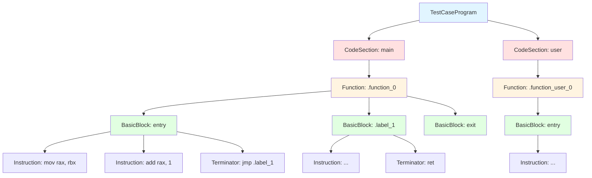
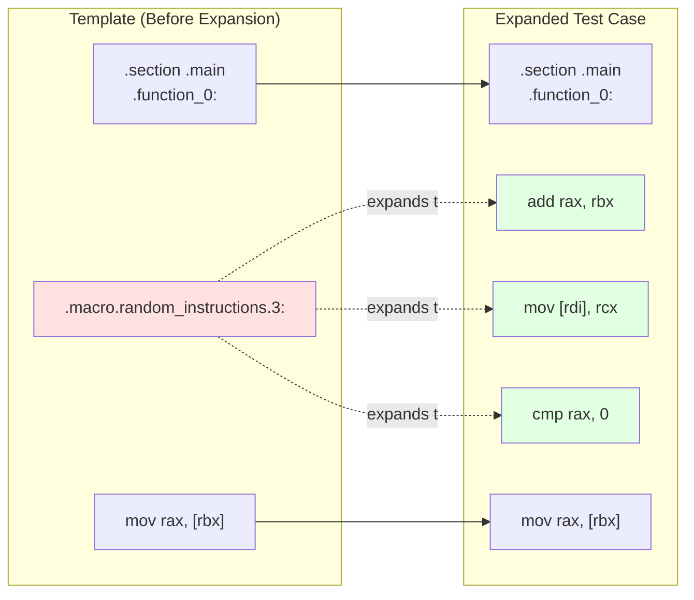
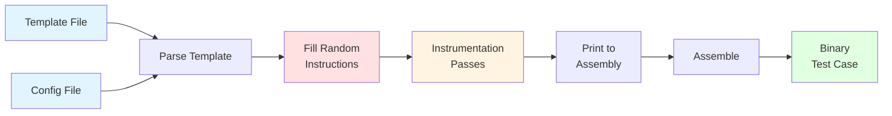

# Test Case Generation

[Test case](../glossary.md#test-case-program) generation is the process of creating executable programs that probe CPU microarchitectural behavior. Revizor generates test cases either randomly or from user-defined templates, then instruments them to prevent unwanted faults, and finally compiles them into binaries suitable for execution. The test cases serve as inputs to both the leakage model and the hardware executor, enabling comparison of expected and observed microarchitectural behavior.

The generator must balance two competing requirements. First, it needs to produce diverse test cases that explore many different microarchitectural conditions and instruction sequences. This diversity is essential for thorough coverage of the CPU's behavior space. Second, when testing specific scenarios like domain transitions or mitigation effectiveness, it must generate programs with precise structures while still varying the surrounding context. This balance distinguishes Revizor's approach from simple random testing.

## Generation Modes

Revizor supports two distinct modes of test case generation, each suited to different testing scenarios.

Random generation creates test cases from scratch without any predefined structure. The generator builds a program by selecting instructions randomly from a configured pool, creating control flow by inserting conditional and unconditional branches, and allocating memory accesses to random addresses. This mode maximizes exploration of the instruction space and frequently discovers unexpected interactions between instructions. Random generation excels at finding vulnerabilities in single execution domains where no specific instruction sequence is required. However, it struggles with scenarios requiring precise setup, such as triggering specific page faults or transitioning between security domains.

Template-based generation starts from a user-written assembly file that defines the overall structure of the test case. The template specifies where random code should be inserted, which domain transitions to perform, and how [actors](../glossary.md#actor) should interact. The generator parses the template, expands special macros that mark randomization points, fills those points with random instructions, and instruments the result. Templates enable testing of specific scenarios while maintaining randomization where it matters. For example, a template can ensure that a kernel-to-user transition occurs at a specific point while randomizing the instructions executed in each domain.

The distinction matters because microarchitectural vulnerabilities often depend on precise conditions. Consider testing whether a CPU leaks kernel data to user space. Random generation might occasionally produce programs that transition to user mode, but the probability is low and the surrounding context may not trigger the vulnerability. A [template](../glossary.md#template) guarantees the transition occurs and controls the operations performed before and after it, dramatically increasing the likelihood of discovering leakage.

## Instrumentation Passes

Generated test cases, whether random or template-based, are not immediately ready for execution. They may contain instruction sequences that trigger unwanted faults, use undefined register values, or violate architectural constraints. Instrumentation passes transform test cases into safe, executable forms while preserving the properties being tested.

Instrumentation operates on the [structured representation of test cases](#test-case-structure). Each pass implements a specific transformation by walking the instruction hierarchy and modifying it according to its rules. Passes run in sequence, with each pass seeing the output of previous passes. This pipeline architecture allows complex transformations to be built from simple components.

One critical example of a pass is the sandboxing pass, which instruments memory accesses to ensure they target valid addresses within the test case's allocated memory. Accesses to unmapped addresses cause page faults. While some test cases intentionally trigger faults, most do not, and random generation can easily produce invalid addresses. The pass analyzes memory operands, identifies potentially invalid accesses, and masks the instruction operands to bound them within the sandbox.

Another example is a pass that prevents division by zero. Divisions by zero and division overflows trigger exceptions on x86-64, which may be undesirable in a fuzzing campaign that does not focus on this specific type of exception. Yet random generator will commonly trigger them, especially the division overflows. This pass mitigates this issue by scanning the instruction stream for division instructions, and it instruments the division operands to ensure they are non-zero and within safe ranges.

The passes are designed to introduce minimal microarchitectural side effects, to avoid interfering with the properties being tested. For example, the instrumentation code primarily uses arithmetic and logical operations that do not have any known speculative effects, and the instructions operate primarily on registers rather than memory. This careful design ensures that the instrumentation does not inadvertently create or mask vulnerabilities (or at least minimizes the chances of doing so).

##  Test Case Structure

A test case is represented internally as a hierarchy of nested components. The following diagram illustrates this hierarchical structure:

At the top level, a TestCaseProgram contains one or more CodeSections. Each CodeSection belongs to a single Actor and holds the code that executes in that actor's context. In single-actor fuzzing, only one section exists. In multi-actor testing, each actor gets its own section with its own code and data.

Within each CodeSection, code is organized into Functions. A Function consists of multiple BasicBlocks connected by control flow. The first block is the entry point, and execution proceeds through the blocks following branches and jumps. This structure mirrors conventional compiler intermediate representations, making it straightforward to apply standard analysis and transformation techniques.

Each BasicBlock contains a sequence of Instructions terminated by zero or more control flow instructions. Regular instructions execute sequentially, while terminators (branches, jumps, returns) determine which block executes next. Instructions themselves are high-level representations that capture the operation, operands, and dependencies. They are not raw bytes but structured objects that can be analyzed and modified by instrumentation passes.

This hierarchical design serves several purposes. It allows instrumentation passes to operate at different levels of granularity, from modifying individual instructions to restructuring entire functions. It makes the structure explicit, eliminating the need to repeatedly parse assembly text. It enables efficient copying and modification when expanding templates. Most importantly, it provides a common representation used throughout the fuzzing pipeline, from generation through model execution to hardware measurement.

## Macro Placeholders

[Macro placeholders](../glossary.md#macro) are the key mechanism for combining fixed structure with randomization. They appear in templates as special labels that get expanded during test case generation. A macro looks like an assembly label but carries semantic meaning. For example, `.macro.random_instructions.64:` tells the generator to insert 64 randomly chosen instructions at that point.

The critical insight is that macros defer decisions. A template author specifies where randomization should occur without specifying the exact instructions. This preserves the ability to test many different instruction sequences while maintaining the overall structure.

Macros also enable progressive refinement of test cases. An initial template might use a single random macro to generate a large instruction sequence. If that discovers a [violation](../glossary.md#violation), the user can refine the template to add more structure around the violation, narrowing the search space. The macro system makes this iteration efficient because templates remain concise and readable.

!!! note "Related Documentation"
    For a complete list of available macros and their specifications, refer to the [Macro Reference](../ref/macros.md).

    For a how-to guide on using macros, see [How-To: Use Macros](../howto/use-macros.md).

## Template Structure and Expansion

Templates use standard assembly syntax with macro extensions. This design choice means templates are valid assembly files that can be processed by conventional tools. Comments, labels, directives, and instructions follow normal assembly conventions. Only the macro pseudo-instructions are specific to Revizor.

Template expansion proceeds in several phases. First, the generator parses the template using a standard assembly parser extended to recognize macros. Parsing produces the hierarchical test case structure described earlier, with macros represented as special instruction types. Next, the generator walks the structure and expands the `random_instructions` macro placeholders to random instruction sequences. Finally, instrumentation passes run, the test case is printed back to assembly, and the assembler produces an object file.

!!! note "Related Documentation"
    For detailed instructions on writing and using templates, refer to [How-To: Use Templates](../howto/use-templates.md).

## Generation Performance

Generation performance affects overall fuzzing throughput, although it usually has a low impact on the overall process compared to the executor and the model. Generation may dominate the execution time only in the rare case where the other components are extremely fast, such as when testing very small test cases with a small (<10) number of inputs.

Both random and template-based generation modes have similar performance as the template is re-used across all generation requests after the first expansion.

## What's Next?

- [Configuration Reference](../ref/config.md): Generator configuration options
- [Actors](actors.md): Security domains represented in test cases
- [Binary Formats](../ref/binary-formats.md): File formats for test case binaries
- [How-To: Use Macros](../howto/use-macros.md): Guide on using macros in templates
- [How-To: Use Templates](../howto/use-templates.md): Guide on writing and using templates
- [Code Generation](../internals/architecture/code.md): Implementation details of code generation and instrumentation
