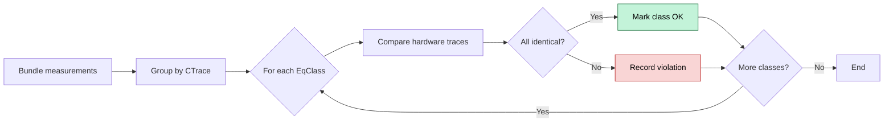

# Trace Analysis

This document describes Revizor's trace analysis techniques for detecting microarchitectural
contract violations by comparing contract traces with hardware traces.

Trace analysis is the core mechanism of Model-Based Relational Testing. It compares
[contract traces](../glossary.md#contract-trace) (predicted leakage from the model) with
[hardware traces](../glossary.md#hardware-trace) (observed leakage from real CPU) to detect
microarchitectural [contract violations](../glossary.md#violation).

## Contract Compliance Property

The fundamental property being tested is [contract compliance](../glossary.md#contract-compliance):
if two inputs produce the same contract trace, they must produce the same hardware trace for all
microarchitectural states.

Formally, a CPU complies with a speculation contract if, for all possible programs P, all input pairs (I₁, I₂), and all initial microarchitectural states Ctx:

```
ContractTrace(P, I₁) = ContractTrace(P, I₂)
  ⟹
HardwareTrace(P, I₁, Ctx) = HardwareTrace(P, I₂, Ctx)
```

If this property is violated, the CPU is leaking information beyond what the contract predicts.
A violation indicates that the contract is incomplete or that the CPU has an unexpected side
channel. See the [primer](../intro/03_primer.md#building-and-testing-speculation-contracts) for
theoretical foundations.

Revizor approximates this property by randomly sampling the space of programs, inputs, and microarchitectural states, and checking for violations based on collected traces.
The following sections describe how this check is implemented in practice.

## Problem Statement

The trace analysis task boils down to the following problem:

=== "Given"

:   - A test program P
    - A sequence of inputs I₁ … Iₙ
    - A sequence of contract traces CTrace₁ … CTraceₙ (one per input, produced by the model)
    - A sequence of hardware traces HTrace₁ … HTraceₙ (one per input, produced by the executor)

<div></div> <!-- empty line for spacing -->

=== "Objective"

:    Detect if there exist any input pairs (Iᵢ, Iⱼ) such that
    ```
    CTraceᵢ = CTraceⱼ but HTraceᵢ ≠ HTraceⱼ
    ```

## Deterministic Trace Comparison

To detect contract violations, we need to check the above property for all tested inputs.
Checking each input pair separately would be extremely inefficient (O(N²) complexity). Instead,
we use an equivalence-class-based algorithm that groups inputs by their contract traces and
checks hardware trace consistency within each group:

1. **Bundle measurements**: Create tuples `(Input ID, Input, CTrace, HTrace)` for each execution
2. **Group by contract trace**: Partition measurements into contract equivalence classes where
   all measurements share the same `CTrace`
3. **Check hardware traces**: Within each contract equivalence class, verify all hardware traces
   are identical
4. **Report violations**: If a contract equivalence class contains different hardware traces,
   report a violation



=== "Example"

    Suppose we test 4 inputs and get:

    ```
    I0: CTrace=A, HTrace=X
    I1: CTrace=A, HTrace=X
    I2: CTrace=B, HTrace=Y
    I3: CTrace=A, HTrace=Z
    ```

    Contract equivalence classes:

    ```
    - Class [CTrace=A]: I0, I1, I3
    - Class [CTrace=B]: I2
    ```

    Analysis:

    - Class `[CTrace=A]` contains three measurements with HTraces `{X, X, Z}`
    - Since X ≠ Z, this is a **violation**
    - Inputs `I0` and `I1` behaved identically (`HTrace=X`) but input `I3` behaved differently (`HTrace=Z`),
    despite having the same contract trace=A
    - Accordingly, we found a violation: `I0` and `I3` have the same contract trace (`A = A`) while
    the hardware traces differ (`X ≠ Z`)

## Statistical Trace Comparison

### The Problem of Noise

Real hardware measurements are noisy. Even if we execute the same program with the same input
repeatedly, we might get different hardware traces each time, due to factors like timing variations
 in microcode execution, cache state changes from uncontrollable sources, non-controlled
 hardware optimizations, etc.

These discrepancies may cause false positives if we directly use the deterministic algorithm,
because the differences between the hardware traces may be caused by noise, not by genuine
information leakage.

=== "Example"
    Suppose we test only two of the inputs from the previous example, but the second
    measurement produces a slightly different hardware trace due to noise:

    ```
    I0: CTrace=A, HTrace=X
    I1: CTrace=A, HTrace=X'
    ```

    The resulting analysis will produce a false violation:

    - Contract equivalence class `[CTrace=A]: I0, I1`
    - Hardware traces: `{X, X'}`
    - Since `X ≠ X'`, we incorrectly report a violation, even though both inputs are actually safe
    and the difference is just noise.

### Solution: Sampling and Statistical Analysis

To address this, we treat hardware traces as samples from a distribution rather than single
deterministic values. Instead of comparing individual hardware traces, we compare the distributions
of hardware traces produced by each input. This replaces the deterministic equality check
`HardwareTrace(P, I₁, Ctx) = HardwareTrace(P, I₂, Ctx)` with a statistical test that
determines if two samples are drawn from the same distribution.

To implement this, we modify the measurement process: instead of collecting one hardware trace
per input, Revizor collects **multiple samples** per input. Each `HTrace` object contains an
array of measurement samples. For example, with sample size N=10:

```
I0: CTrace=A, HTrace=[X, X, X', X, X, X', X, X, X, X]
I1: CTrace=A, HTrace=[X, X', X, X, X, X, X', X, X, X]
```

Now we must compare **distributions** rather than individual values, and the question becomes: "Are these two samples drawn from the same distribution?"

### Chi-Squared Test for Categorical Data

Hardware traces are categorical data (no natural ordering), so Revizor uses Pearson's χ²
homogeneity test.

Given two samples `t₁` and `t₂` of hardware traces, the test computes:

```
χ² = Σ (obs₁(t) - expected(t))² / expected(t)
   + Σ (obs₂(t) - expected(t))² / expected(t)
```

where:

- `obs₁(t)` = count of trace `t` in sample 1
- `obs₂(t)` = count of trace `t` in sample 2
- `expected(t) = (obs₁(t) + obs₂(t)) / 2` = average count

The χ² statistic is normalized by total sample size to make it comparable across different
sample sizes.

**Decision rule**: If `χ²/N < threshold`, accept that the samples come from the same
distribution (no violation).

The threshold is configurable (default 0.05) and can be tuned based on expected noise levels via [`analyser_stat_threshold`](../ref/config.md#analyser_stat_threshold) config parameter.

The following examples illustrate how the χ² test distinguishes between noise and real violations.

=== "No violation"

    ```
    I0: CTrace=A, HTrace=[X(8 times), X'(2 times)]
    I1: CTrace=A, HTrace=[X(7 times), X'(3 times)]
    ```

    The distributions are similar (mostly X with some noise X'). χ² test will show they're
    equivalent:

    ```
    obs₁(X) = 8, obs₁(X') = 2
    obs₂(X) = 7, obs₂(X') = 3
    expected(X) = (8 + 7) / 2 = 7.5
    expected(X') = (2 + 3) / 2 = 2.5
    χ² = (8 - 7.5)²/7.5 + (2 - 2.5)²/2.5 + (7 - 7.5)²/7.5 + (3 - 2.5)²/2.5
       = 0.2666
    χ²/N = 0.2666/10 = 0.02666
    χ²/N < 0.05 → accept equivalence (no violation)
    ```


=== "Real violation"

    ```
    I0: CTrace=A, HTrace=[X(5 times), X'(1 time), Y(4 times)]
    I1: CTrace=A, HTrace=[X(5 times), X'(1 time), Z(4 times)]
    ```

    The distributions are clearly different (X vs Y). χ² test will reject equivalence → violation:
    ```
    obs₁(X) = 5, obs₁(X') = 1, obs₁(Y) = 4
    obs₂(X) = 5, obs₂(X') = 1, obs₂(Z) = 4
    expected(X) = (5 + 5) / 2 = 5
    expected(X') = (1 + 1) / 2 = 1
    expected(Y) = (4 + 0) / 2 = 2
    expected(Z) = (0 + 4) / 2 = 2
    χ² = (5 - 5)²/5 + (1 - 1)²/1 + (4 - 2)²/2 + (0 - 2)²/2
       + (5 - 5)²/5 + (1 - 1)²/1 + (0 - 2)²/2 + (4 - 2)²/2
       = 8
    χ²/N = 8/10 = 0.8
    χ²/N > 0.05 → reject equivalence (violation)
    ```

### Adaptive Sample Sizing

For performance reasons, Revizor does not immediately use a large sample size. Instead, it
starts with a small sample, collects the traces, and checks if a violation is detected. If no
violation is detected, the executor assumes that the test case is safe, and moves on to the next
one. If a violation is detected, however, the executor tries to reproduce it with larger sample
sizes.

Example adaptive strategy:

``` python
for N in [15, 40, 160, 320]:
    collect N samples per input
    if violation detected:
        continue
    else:
        return "no violation"
return "violation detected"
```

The exact sample sizes and thresholds are configurable via [`executor_sample_sizes`](../ref/config.md#executor_sample_sizes) config parameter.

## What's Next?

- [Configuration Options](../ref/config.md) - Configure analyzer parameters
- [Model-Based Relational Testing](../intro/03_primer.md) - Theoretical foundations
- [Analyser Architecture](../internals/architecture/analysis.md) - Implementation
  details
