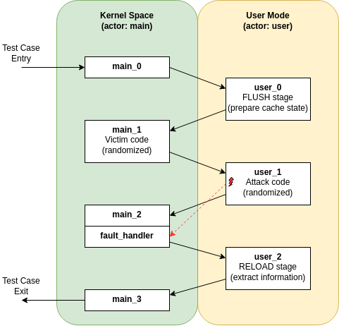

# Tutorial: Detecting TSA-SQ with Revizor

This tutorial demonstrates how we used Revizor to detect TSA-SQ (Transient Scheduler Attack - Store Queue), a microarchitectural vulnerability discovered in AMD Zen4 processors. We'll walk through the design rationale behind the fuzzing campaign configuration and template, explaining how each component contributes to successful vulnerability detection.

You can reproduce this campaign using the provided configuration and template files, which are available in the Revizor repository under `demo/tsa-sq/`.

## Prerequisites

To follow this tutorial, you should have:

- Non-virtualized access to an AMD Zen4 processor for testing
- A working installation of Revizor. See [quickstart guide](../quick-start.md) for setup instructions.
- Basic understanding of Revizor's fuzzing framework, in particular the concepts of [model-based relational testing](../contracts.md), [actors](../user/actors.md), [templates](../user/templates.md), [macros](../user/macros.md).
- Familiarity with microarchitectural vulnerabilities and side-channel attacks


## Background: Understanding TSA-SQ

Before diving into the Revizor configuration, let's briefly understand what TSA-SQ is. According to the [AMD security bulletin](https://www.amd.com/content/dam/amd/en/documents/resources/bulletin/technical-guidance-for-mitigating-transient-scheduler-attacks.pdf), TSA-SQ exploits timing variations in the CPU's store queue during "false completion" events. When a load instruction matches the address of an older store whose data isn't yet available, it may complete falsely using stale data from a previous store that occupied the same store queue entry. This creates timing differences that an attacker can observe to infer information about previous stores, even from different privilege levels.

The key insight is that an unprivileged user process can potentially observe timing variations that depend on data from kernel stores, creating a kernel-to-user information leak channel.

## Design Rationale

When this campaign was designed, we were not yet aware of the TSA-SQ vulnerability (in fact, the vulnerability was discovered as *result* of this campaign). Therefore, the campaign design is not specifically tailored to detect TSA-SQ, but rather to stress-test the general isolation between kernel and user modes in a way that could reveal microarchitectural vulnerabilities.

## Threat Model and Actor Configuration

Our fuzzing campaign targets a common and high-impact threat model: a malicious user process attempting to extract sensitive data from the kernel. This scenario is particularly relevant for privilege escalation attacks where an attacker seeks to leak kernel secrets.

The actor section of `config.yaml` reflects this threat model:

```yaml
actors:
  - main:
    - mode: "host"
    - privilege_level: "kernel"
    ...
  - user:
    - observer: true
    - mode: "host"
    - privilege_level: "user"
```

The `main` actor represents the victim kernel, while the `user` actor represents the attacker. The `observer: true` flag designates the user actor as the attacker attempting to extract information. This configuration, in combination with the noninterference contract, tells Revizor that any information leakage from `main` to `user` should be flagged as a violation.

## Template Design: Simulating Attack Patterns

The template structure follows the typical flow of a microarchitectural side-channel attack, specifically implementing a Flush+Reload pattern across privilege transitions.



Let's examine each phase:

**Phase 1: Setup and Flush (function_main_0 and function_user_0)**

The first stage represent the attacker preparing the microarchitectural state for measurements. The first action in the template is in the `function_user_0`, where the `user` actor initializes the microarchitectural state by flushing the cache lines that will be used for measurements. This is done using the `measurement_start` macro, which is translated into a Flush stage of Flush+Reload attack. Revizor does this translation automatically based on the `executor_mode: F+R` setting in the configuration file.

Note that the template does not actually start from the `function_user_0` actor function. Instead, it starts with the `function_main_0`, which is a function belonging to the `main` actor. This is because Revizor requires that the entry point to the test case must be within the `main` actor's code.

**Phase 2: Secret Injection (function_main_1)**

After the initial setup, the attacker transitions to the victim and let's it do some computations on the victim's secret data. The victim actor execute a sequence of random instructions in the `function_main_1` macro, which simulates the kernel performing operations on sensitive data. Here, "random instructions" means a sequence of instructions that is randomly generated in each fuzzing round (i.e., each generated test case will have a different sequence of instructions in `function_main_1`).

This randomness is crucial because it allows us to test a wide range of ways how secret data can impact microarchitectural state, without knowing a priori what specific instruction sequences might trigger a leak. This was one of the key factors that allowed us to discover TSA vulnerabilities without knowing about them beforehand.

**Phase 3: Secret Extraction (function_user_1)**

Back in user mode, we first clear the architectural state to eliminate any architectural information flow between actors. This is necessary to prevent any architectural information flows between the actors, which could otherwise lead to false positives in the analysis because Revizor is unable to distinguish between architectural and microarchitectural information flows (to be precise, Revizor would be able to distinguish them with a more subtle contract, but re-initializing the registers is a simpler solution).

```assembly
xor rax, rax  # noremove
mov rax, qword ptr [r14 + 0x2000] # noremove
mov rbx, qword ptr [r14 + 0x2008] # noremove
# ... more register initialization
```

After that, the attacker execute another sequence of random instructions, which simulates the user process attempting to access the sensitive data that was just processed by the kernel. Note that this sequence may include an attempt to access kernel memory from the user mode (see the `user-to-kernel-access` fault allowlist in the configuration). As we found out post-factum, this is not strictly necessary for TSA-SQ, but it helps to create complex microarchitectural conditions that can trigger the leak.

Depending on whether random instruction sequence triggers the fault, the user actor will either switch to the kernel mode explicitly (using the `switch_u2k.main.user_1` macro) or the CPU will transfer control to the fault handler (`fault_handler` macro in the `function_main_2`). In this experiment, we were not particularly interested in fault handling, so both paths lead to the same point in the template.

**Phase 4: State Measurement (function_user_2)**

Finally, the "Reload" stage in `function_user_2` measures which cache lines were accessed by the random code in the previous stage. If the accessed cache lines were somehow influenced by the kernel's secret data, this will lead to a discrepancy in the "Reload" measurements, leading to diverging hardware traces for different inputs, and ultimately to Revizor detecting a violation.

## Configuration Overview

Beyond the actor configuration, `config.yaml` contains several other important settings that guide the fuzzing campaign, as described next:

* **Contract**: The contract configuration specifies what information leakage we consider acceptable

```yaml
contract_observation_clause: ct
contract_execution_clause:
  - noninterference
```

The `noninterference` execution clause implements the security property that observer actors cannot learn information about non-observer actors through microarchitectural channels. Combined with the `ct` (constant-time) observation clause, this allows the observer to see memory access patterns and control flow but prohibits leakage of raw data values.

* **Exceptions**: The configuration includes `user-to-kernel-access` in the fault allowlist, which enables testing for Meltdown-type vulnerabilities. This was part of our original experimental design when we didn't yet know about TSA's existence. Revizor's program generator will randomly select memory accesses in the user actor and modify them to target kernel memory, triggering page faults.

Interestingly, this exception-based approach helped discover TSA-SQ because the false completion events in the store queue can lead to timing differences in subsequent instructions, and the faults provide a constant-time reference point for the timing differences to get transformed into persistent cache state. Namely, when a variable-latency instruction is executed concurrently with a faulting instruction, it creates a race condition, where the cache impact of the variable-latency instruction can be influenced by whether the faulting instruction completes before or after it.

Note the fault configuration quirk: we enable `user-to-kernel-access` globally but block it specifically for the main actor using `fault_blocklist`. This is the only way to enable a fault for a specific actor, because Revizor does not allow faults to be allow-listed for a specific actor.

* **Statistical Analysis**: The statistical analysis parameters balance sensitivity with noise tolerance:

```yaml
analyser_stat_threshold: 0.05
executor_sample_sizes: [15, 40, 160, 320]
```

The low threshold of 0.05 makes the analysis sensitive to subtle timing differences, while the adaptive sample sizes allow Revizor to start with quick tests and increase precision when potential violations are detected.

* **Instruction Set**: The instruction set is defined as `x86-64` because we are targeting AMD CPUs, and the instruction categories include all base instructions, which allows for a wide range of microarchitectural interactions in the randomly generated code. Ideally, we would include even more categories, such as SIMD extensions and other advanced instructions, but Revizor does not yet support them (coming up soon, though!).

## Running the Campaign

With the configuration and template in place, we can run the detection campaign using Revizor's `tfuzz` command. This command generates test cases based on the provided template and configuration, executes them, and analyzes the results for violations.

```shell
./revizor.py tfuzz -s base.json --save-violations t -w ./results/ \
    -c config.yaml -t template.asm -n 100000 -i 25
```

This runs 100,000 test cases with 25 inputs each. The `--save-violations` flag preserves any detected violations for later analysis. When TSA-SQ is present, you'll eventually see output similar to:

```
================================ Violations detected ==========================
Contract trace:
 14140085380608124960 (hash)
Hardware traces:
  Input group 1: [11]
  Input group 2: [36]
  ^^^.........^.................................^^................ [287    | 36    ]
  ^^^.........^.................................^................. [31     | 284   ]
```

The different hardware trace patterns for inputs 11 and 36, despite having the same contract trace hash, indicate that the CPU is leaking information not predicted by the noninterference contract.

On our machine, the campaign typically takes about 5 hours to detect a leak, but your mileage may vary depending on the CPU model and due to the inherent randomness of the process.

## Verifying Genuine Violations

To confirm that a detected violation is genuine, reproduce it using:

```bash
./revizor.py reproduce -s base.json -c ./results/violation-*/reproduce.yaml \
    -t ./results/violation-*/program.asm -i ./results/violation-*/input_*.bin
```

A genuine violation will reproduce consistently across multiple runs with the same statistical pattern, confirming that the timing differences represent a real microarchitectural information leak.

The next step is to do root-cause analysis of the violation, which is beyond the scope of this tutorial. See [Root-Causing a Violation Detected by Revizor](root-causing.md) for details on this process.

